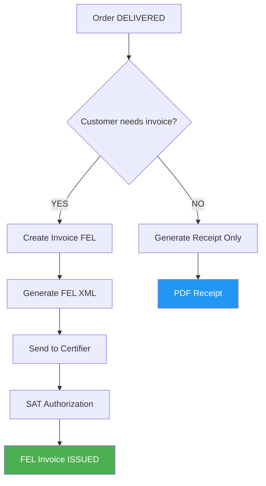

# 🇬🇹 FEL Integration - Guatemala Electronic Invoicing

## 📋 Overview

This document describes the complete FEL (Facturación Electrónica en Línea) integration implemented for Guatemala's electronic invoicing system. The integration supports both scenarios: customers who need official FEL invoices and those who only need receipts.

## 🏗️ Architecture

### Core Components



### Database Schema Changes

The `invoices` table has been extended with FEL-specific fields:

```sql
-- FEL (Facturación Electrónica en Línea) Fields
fel_uuid VARCHAR                -- SAT UUID
dte_number VARCHAR              -- DTE Number  
fel_authorization_date TIMESTAMPTZ
fel_xml_path VARCHAR            -- Generated XML path
fel_certification_date TIMESTAMPTZ
fel_certifier VARCHAR           -- Certifier used
fel_series VARCHAR              -- FEL Series
fel_number VARCHAR              -- FEL Number
fel_error_message TEXT          -- Error if failed
requires_fel BOOLEAN DEFAULT TRUE
```

### Invoice Status Flow

```python
class InvoiceStatus(str, enum.Enum):
    DRAFT = "draft"                    # Initial state
    FEL_PENDING = "fel_pending"        # Being processed by FEL
    FEL_AUTHORIZED = "fel_authorized"  # Authorized by SAT
    FEL_REJECTED = "fel_rejected"      # Rejected by SAT  
    ISSUED = "issued"                  # Officially issued
    PAID = "paid"                      # Payment received
    OVERDUE = "overdue"                # Past due
    CANCELLED = "cancelled"            # Cancelled
```

## 📊 Business Flows

### Flow 1: Customer Requires FEL Invoice

```
1. Order Status: DELIVERED
2. Create Invoice (requires_fel=True) 
3. Status: DRAFT → FEL_PENDING
4. Generate FEL XML
5. Send to Certifier (Digifact/FacturasGT)
6. SAT Authorization → UUID received
7. Status: FEL_AUTHORIZED → ISSUED
8. Generate PDF with UUID
9. Customer can deduct IVA
```

### Flow 2: Customer Doesn't Need Invoice

```
1. Order Status: DELIVERED
2. Generate Receipt Only
3. PDF with "COMPROBANTE" (not fiscal)
4. Customer cannot deduct IVA
5. No SAT registration required
```

## 🛠️ API Endpoints

### Invoice Creation

#### Create FEL Invoice
```http
POST /invoices/orders/{order_id}/auto-invoice-with-fel
```
Creates invoice and processes FEL automatically.

#### Create Receipt Only
```http
POST /invoices/orders/{order_id}/receipt-only
```
Generates receipt without FEL processing.

### FEL Processing

#### Process Existing Invoice
```http
POST /invoices/{invoice_id}/fel/process?certifier=digifact
```

#### Retry Failed FEL
```http
POST /invoices/fel/retry-failed?certifier=digifact
```

### Reporting

#### FEL Status Summary
```http
GET /invoices/fel/status-summary
```

#### Fiscal Revenue (FEL Only)
```http
GET /invoices/revenue/fiscal?start_date=2024-01-01&end_date=2024-12-31
```

## 💻 Usage Examples

### 1. Customer Requests Invoice

```bash
# Create invoice with FEL processing
curl -X POST "http://localhost:8000/invoices/orders/123/auto-invoice-with-fel?certifier=digifact" \
     -H "Authorization: Bearer YOUR_TOKEN" \
     -H "Content-Type: application/json"
```

**Response:**
```json
{
  "id": 456,
  "invoice_number": "FAC-2024-001234",
  "status": "fel_authorized",
  "fel_uuid": "12345678-1234-1234-1234-123456789012",
  "dte_number": "DTE-12345678",
  "fel_series": "A",
  "fel_number": "20241201123456",
  "total_amount": 1120.00,
  "tax_amount": 120.00,
  "requires_fel": true
}
```

### 2. Customer Only Needs Receipt

```bash
# Generate receipt without FEL
curl -X POST "http://localhost:8000/invoices/orders/123/receipt-only" \
     -H "Authorization: Bearer YOUR_TOKEN" \
     -H "Content-Type: application/json"
```

Returns PDF receipt with "COMPROBANTE DE PEDIDO" (not fiscal).

### 3. Check FEL Status

```bash
# Get FEL processing summary
curl -X GET "http://localhost:8000/invoices/fel/status-summary" \
     -H "Authorization: Bearer YOUR_TOKEN"
```

**Response:**
```json
{
  "total_fel_invoices": 150,
  "by_status": {
    "fel_authorized": 120,
    "fel_pending": 5,
    "fel_rejected": 3,
    "issued": 115,
    "paid": 80
  },
  "processing_needed": 8,
  "successfully_processed": 235
}
```

### 4. Get Fiscal Revenue

```bash
# Get revenue from FEL-authorized invoices only
curl -X GET "http://localhost:8000/invoices/revenue/fiscal?start_date=2024-01-01&end_date=2024-12-31" \
     -H "Authorization: Bearer YOUR_TOKEN"
```

**Response:**
```json
{
  "period": {
    "start_date": "2024-01-01",
    "end_date": "2024-12-31"
  },
  "fiscal_revenue": {
    "total_invoiced": 156750.00,
    "total_collected": 145230.00,
    "total_invoices": 120,
    "average_invoice": 1306.25,
    "collection_rate": 92.65
  },
  "note": "Only includes FEL-authorized invoices (fiscally valid)"
}
```

## ⚙️ Configuration

### Environment Variables

```bash
# FEL Configuration
FEL_ENVIRONMENT=test  # or production
COMPANY_NIT=12345678-9

# Digifact Configuration
FEL_DIGIFACT_USERNAME=your_username
FEL_DIGIFACT_PASSWORD=your_password

# FacturasGT Configuration  
FEL_FACTURASGT_USERNAME=your_username
FEL_FACTURASGT_PASSWORD=your_password
```

### Supported Certifiers

1. **Digifact** (`digifact`)
   - Base URL: `https://felgtaws.digifact.com.gt`
   - Test environment supported
   
2. **FacturasGT** (`facturasgt`)
   - Base URL: `https://ws.facturasgt.com` 
   - Mock implementation (extend for production)

## 🔧 Installation & Setup

### 1. Run Database Migration

```bash
cd scripts/
python migrate_fel_integration.py
```

### 2. Verify Migration

```bash
python migrate_fel_integration.py --verify-only
```

### 3. Test Integration

```bash
python test_fel_integration.py
```

### 4. Rollback (if needed)

```bash
python migrate_fel_integration.py --rollback
```

## 📊 Revenue Reporting

### Business Revenue vs Fiscal Revenue

```python
# Business Revenue (all delivered orders)
business_revenue = sum(order.total_amount for order in delivered_orders)

# Fiscal Revenue (only FEL-authorized invoices)  
fiscal_revenue = sum(
    invoice.paid_amount 
    for invoice in invoices
    where invoice.fel_uuid is not None
    and invoice.status in ['fel_authorized', 'issued', 'paid']
)
```

### Dashboard Metrics

The system provides comprehensive metrics:

- **Total Business Revenue**: All delivered orders
- **Fiscal Revenue**: Only FEL-authorized invoices  
- **Receipt-Only Sales**: Orders without FEL processing
- **Collection Rate**: Paid vs invoiced amounts
- **FEL Success Rate**: Authorized vs attempted

## 🚨 Error Handling

### Common FEL Errors

1. **FEL_PENDING**: Connection issues (will retry)
2. **FEL_REJECTED**: Data validation errors
3. **Connection Timeout**: Network issues with certifier
4. **Invalid XML**: Malformed FEL document

### Retry Logic

Failed FEL processing can be retried:

```bash
POST /invoices/fel/retry-failed?certifier=digifact
```

## 🔒 Security Considerations

- FEL credentials stored in environment variables
- All endpoints require authentication
- XML files stored securely with proper permissions
- UUID validation prevents duplicate submissions

## 📋 Compliance

This implementation complies with:

- Guatemala SAT FEL requirements
- XML structure per SAT specifications  
- Proper tax calculations (12% IVA)
- Required fields for electronic invoicing
- Audit trail maintenance

## 🧪 Testing

### Unit Tests
```bash
python test_fel_integration.py --service-only
```

### XML Generation Test
```bash
python test_fel_integration.py --xml-only
```

### Complete Test Suite
```bash
python test_fel_integration.py
```

### Usage Examples
```bash
python test_fel_integration.py --examples
```

## 📝 Maintenance

### Monitor FEL Status

Regular monitoring recommended:

```sql
-- Check FEL processing status
SELECT status, COUNT(*) 
FROM invoices 
WHERE requires_fel = true 
GROUP BY status;

-- Check pending FEL invoices
SELECT id, invoice_number, fel_error_message
FROM invoices 
WHERE status IN ('fel_pending', 'fel_rejected')
AND requires_fel = true;
```

### Cleanup Old FEL Files

```bash
# Clean XML files older than 1 year
find invoices/fel_xml -name "*.xml" -mtime +365 -delete
```

## 🚀 Future Enhancements

1. **Multiple Series Support**: Different FEL series per business unit
2. **Credit Notes**: FEL support for refunds/credits
3. **Real-time Sync**: Webhook integration with certifiers
4. **Advanced Reporting**: Detailed FEL analytics dashboard
5. **Batch Processing**: Bulk FEL processing for high-volume scenarios

---

## 📞 Support

For FEL integration issues:
1. Check logs in application
2. Verify certifier connectivity
3. Validate XML format
4. Contact SAT for authorization issues
5. Review certifier documentation

**Implemented by**: AI Assistant
**Date**: December 2024
**Version**: 1.0.0

