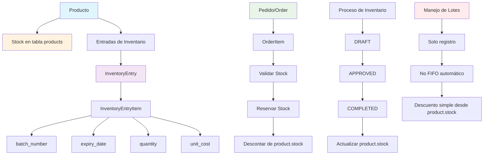

# 📦 Flujo de Inventario, Productos y Pedidos

## Diagrama del Sistema



## 1. 📊 Manejo del Stock

### Stock Actual (Tabla `products`)
- **Campo**: `products.stock` (Integer)
- **Función**: Contiene el stock disponible actual consolidado
- **Actualización**: Solo cuando las entradas de inventario están en estado `COMPLETED`
- **Uso**: Verificación de disponibilidad en pedidos

### Historial de Movimientos (Sistema `inventory_entries`)
- **Tabla principal**: `inventory_entries` - Registra entradas (compras, producciones, ajustes)
- **Tabla detalle**: `inventory_entry_items` - Detalle de cada producto por entrada, incluyendo lotes

## 2. 🏭 Sistema de Entradas de Inventario

### Tipos de Entradas
```python
class EntryType(str, enum.Enum):
    PRODUCTION = "production"     # Producción interna
    PURCHASE = "purchase"         # Compra a proveedores  
    RETURN = "return"            # Devolución de clientes
    ADJUSTMENT = "adjustment"     # Ajuste de inventario
    TRANSFER = "transfer"        # Transferencia entre bodegas
    INITIAL = "initial"          # Inventario inicial
```

### Estados del Flujo
```python
class EntryStatus(str, enum.Enum):
    DRAFT = "draft"              # Borrador
    PENDING = "pending"          # Pendiente de aprobación
    APPROVED = "approved"        # Aprobado
    COMPLETED = "completed"      # Completado (stock actualizado)
    CANCELLED = "cancelled"      # Cancelado
```

### ⚠️ **IMPORTANTE**: 
**El stock en `products.stock` SOLO se actualiza cuando la entrada está en estado `COMPLETED`**

## 3. 📋 Sistema de Lotes (Batches)

### ✅ Lo que SÍ hace el sistema:
- Cada `InventoryEntryItem` puede tener:
  - `batch_number` (String, opcional)
  - `expiry_date` (DateTime, opcional)
- Registra el lote cuando se recibe mercancía
- Mantiene historial de qué lotes ingresaron

### ❌ Lo que NO hace el sistema:
- **No hay tabla separada para lotes**
- **No implementa FIFO (First In, First Out) automático**
- **No rastrea qué lote específico se vende en cada pedido**

### Ejemplo Práctico:
```
Entrada 1: Producto A, Lote "L001", Cantidad: 100, Vence: 2024-12-31
Entrada 2: Producto A, Lote "L002", Cantidad: 50,  Vence: 2024-11-30

Stock actual en products.stock = 150

Al hacer pedido de 80 unidades:
- Se descuentan 80 del products.stock (queda 70)
- NO se especifica de qué lote se descontó
```

## 4. 🛒 Flujo de Pedidos y Descuento de Stock

### Proceso paso a paso:

#### **Paso 1: Validación de Stock**
```python
# Verifica si el producto existe, está activo y tiene stock suficiente
def check_stock_availability(product_id, required_quantity):
    product = get_product(product_id)
    if not product or not product.is_active:
        return False
    return product.stock >= required_quantity
```

#### **Paso 2: Reserva de Stock**
```python
# Descuenta inmediatamente del stock disponible
def reserve_stock(product_id, quantity):
    if not check_stock_availability(product_id, quantity):
        return False
    # quantity será negativo para descuentos
    return update_stock(product_id, -quantity)
```

#### **Paso 3: Creación del Pedido**
- Si la creación del pedido falla, se restaura automáticamente el stock
- Implementa rollback automático en caso de errores

#### **Paso 4: Cancelación de Pedidos**
- Solo se pueden cancelar pedidos en estado `PENDING` o `CONFIRMED`
- Al cancelar, se restaura automáticamente el stock de todos los productos

## 5. 🔄 Estados de Pedidos

```python
class OrderStatus(str, enum.Enum):
    PENDING = "pending"           # Pendiente
    CONFIRMED = "confirmed"       # Confirmado
    IN_PROGRESS = "in_progress"   # En progreso
    SHIPPED = "shipped"           # Enviado
    DELIVERED = "delivered"       # Entregado
    CANCELLED = "cancelled"       # Cancelado
```

### Transiciones Válidas:
- `PENDING` → `CONFIRMED` | `CANCELLED`
- `CONFIRMED` → `IN_PROGRESS` | `CANCELLED`
- `IN_PROGRESS` → `SHIPPED` | `CANCELLED`
- `SHIPPED` → `DELIVERED`
- `DELIVERED` → (final)
- `CANCELLED` → (final)

## 6. 🚨 Limitaciones Actuales

### Manejo de Lotes:
1. **No hay control FIFO**: No se maneja automáticamente qué lote usar primero
2. **No hay trazabilidad**: No se puede rastrear qué lote específico se vendió
3. **Descuento simple**: Solo se descuenta del stock total consolidado

### Sugerencias de Mejora:
1. **Implementar tabla de lotes separada** para mejor control
2. **Agregar lógica FIFO automática** para productos con fecha de vencimiento
3. **Rastrear lotes en OrderItems** para trazabilidad completa
4. **Alertas de vencimiento** para lotes próximos a expirar

## 7. 📁 Archivos Principales

- **Modelos**: `app/models/product.py`, `app/models/inventory_entry.py`, `app/models/order.py`
- **Servicios**: `app/services/product_service.py`, `app/services/inventory_entry_service.py`, `app/services/order_service.py`
- **Repositorios**: `app/repositories/product_repository.py`, `app/repositories/inventory_entry_repository.py`
- **APIs**: `app/api/v1/products.py`, `app/api/v1/inventory.py`, `app/api/v1/orders.py`
